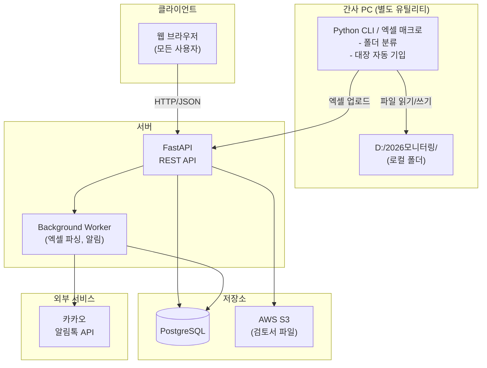
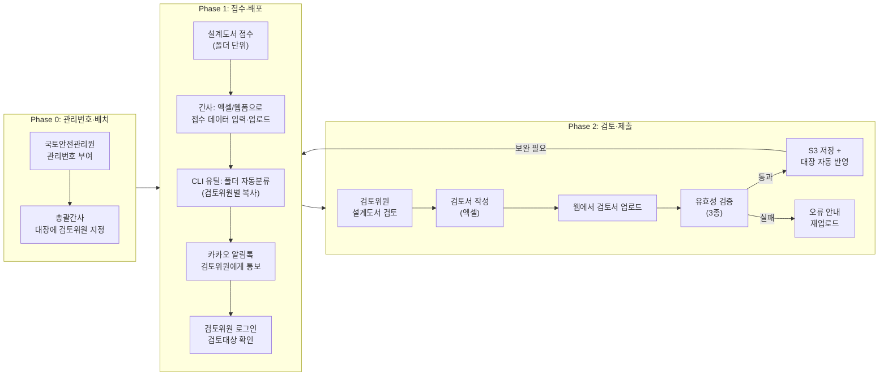

# 건축구조안전 모니터링 시스템 - 구현 계획서

## Context

건축구조안전 모니터링 업무(관리번호 부여 → 설계도서 배포 → 검토서 수집 → 보완 반복)를 현재 엑셀 기반 수작업으로 처리하고 있음. 이를 **웹 기반 통합 시스템**으로 전환하여 총괄간사·검토위원 간 업무 자동화를 달성하는 것이 목적.

- 접수 도서 데이터는 **간사가 엑셀(또는 웹 폼)에 입력 후 업로드**하는 방식
- 로컬 폴더 자동화(Electron)는 불필요 → **별도 엑셀 매크로/유틸리티**로 데이터 입력 보조
- 시스템은 순수 웹 앱으로 구성

**사용자 규모**: 팀장 1 + 총괄간사 1 + 간사 5 + 검토위원 50 ≈ 약 60명
**핵심 데이터**: 통합관리대장 (102열, 1500+ 행, 예비검토~N차 보완 반복 구조)

---

## 기술 스택

```
┌─────────────────────────────────────────────────┐
│                    Frontend                      │
│  Next.js 14 (App Router) + TypeScript            │
│  Tailwind CSS + shadcn/ui                        │
│  TanStack Table (대장 그리드)                     │
│  React Hook Form + Zod (검토서 업로드/유효성)     │
└────────────────────┬────────────────────────────┘
                     │ REST API (JSON)
┌────────────────────▼────────────────────────────┐
│                    Backend                        │
│  FastAPI (Python 3.11+)                          │
│  SQLAlchemy + Alembic (ORM/마이그레이션)          │
│  openpyxl (엑셀 읽기/쓰기/검증)                  │
│  Pydantic v2 (모델 검증)                         │
│  python-jose + passlib (JWT 인증)                │
└────────────────────┬────────────────────────────┘
                     │
┌────────────────────▼────────────────────────────┐
│               Infrastructure                     │
│  PostgreSQL 15 (마스터 DB)                       │
│  AWS S3 (검토서 파일 저장)                        │
│  카카오 알림톡 API (검토위원 알림)                │
└─────────────────────────────────────────────────┘

┌─────────────────────────────────────────────────┐
│            별도 유틸리티 (간사용)                  │
│  Python CLI 또는 엑셀 VBA 매크로                  │
│  - 접수 폴더 스캔 → 관리번호 파싱                 │
│  - 통합관리대장 엑셀 자동 기입                    │
│  - 검토위원별 폴더 생성/파일 복사                 │
└─────────────────────────────────────────────────┘
```

### 스택 선정 근거

| 결정 | 이유 |
|------|------|
| **Next.js + FastAPI** | 기존 repo(MIDAS 프로젝트)와 동일 스택 → 학습곡선 최소화 |
| **PostgreSQL** (엑셀 직접 조작 X) | 50명 동시 접근 시 엑셀 파일 잠금/충돌 불가피. DB를 마스터로 두고 엑셀은 import/export만 |
| **S3** (Google Drive X) | API 안정성, 버전 관리, 접근 제어 우수. 날짜별 prefix로 폴더 구조 |
| **별도 Python CLI/매크로** (Electron X) | 로컬 폴더 작업은 간사 PC에서 가끔 실행 → 데스크톱 앱 불필요, 경량 스크립트로 충분 |
| **카카오 알림톡** | 비즈메시지 채널로 정보성 알림 발송 가능 |

---

## 시스템 아키텍처



---

## 데이터 모델 (핵심 테이블)

```
┌──────────────┐     ┌──────────────────┐     ┌───────────────┐
│    users     │     │    buildings     │     │   reviewers   │
├──────────────┤     ├──────────────────┤     ├───────────────┤
│ id (PK)      │     │ id (PK)          │     │ id (PK)       │
│ name         │     │ mgmt_no (UNIQUE) │     │ user_id (FK)  │
│ role (enum)  │◄────│ reviewer_id (FK) │     │ group_no      │
│ phone        │     │ address          │     │ specialty     │
│ kakao_id     │     │ gross_area       │     └───────────────┘
│ password_hash│     │ floors_above     │
└──────────────┘     │ floors_below     │
                     │ main_structure   │
                     │ main_usage       │
                     │ high_risk_type   │
                     │ architect_firm   │
                     │ struct_engineer  │
                     │ current_phase    │
                     │ final_result     │
                     └────────┬─────────┘
                              │ 1:N
                     ┌────────▼─────────┐
                     │  review_stages   │
                     ├──────────────────┤
                     │ id (PK)          │
                     │ building_id (FK) │
                     │ phase (enum)     │  ← 예비/1차/2차/3차...
                     │ doc_distributed  │  ← 도서배포일
                     │ report_submitted │  ← 검토서 제출일
                     │ reviewer_name    │
                     │ result (enum)    │  ← 적합/보완/부적합
                     │ defect_type_1    │
                     │ defect_type_2    │
                     │ defect_type_3    │
                     │ review_opinion   │
                     │ objection_filed  │  ← 이의신청 여부
                     │ objection_reason │
                     │ s3_file_key      │  ← 검토서 파일 경로
                     └──────────────────┘
```

---

## 구현 단계 (4단계)

### Stage 1: 기반 구축 (2~3주)

**목표**: 인증, DB, 통합관리대장 import/export, 엑셀 입력 유틸리티

| # | 작업 | 파일/위치 |
|---|------|-----------|
| 1-1 | PostgreSQL 스키마 + Alembic 마이그레이션 | `backend/models/`, `alembic/` |
| 1-2 | JWT 인증 + RBAC (팀장/총괄간사/간사/검토위원) | `backend/routers/auth.py`, `backend/auth_middleware.py` |
| 1-3 | 통합관리대장 엑셀 → DB import 엔진 | `backend/engines/ledger_import.py` |
| 1-4 | DB → 엑셀 export (열 매핑 102열 재현) | `backend/engines/ledger_export.py` |
| 1-5 | 사용자 관리 CRUD API + 프론트 페이지 | `frontend/app/admin/` |
| 1-6 | **엑셀 입력 유틸리티** (간사용 Python CLI) | `tools/ledger_tool.py` |

#### 1-6 엑셀 입력 유틸리티 상세

간사가 로컬 PC에서 실행하는 Python CLI 도구:

```
python ledger_tool.py classify --source "D:/2026모니터링/01.접수자료/예비검토/20260501" \
                                --target "D:/2026모니터링/02.배포자료" \
                                --ledger "통합관리대장.xlsx"
```

기능:
- **자료분류**: 접수 폴더 스캔 → 폴더명에서 관리번호 파싱(`2026-0001_서울시...`) → 통합관리대장에서 해당 관리번호의 검토위원 조회 → 검토위원 이름 폴더 생성 + 파일 복사
- **대장 기입**: 검토서 내용을 읽어 통합관리대장의 해당 행에 자동 기입
- **웹 업로드**: 처리 완료 후 API를 호출하여 DB에도 동기화 (선택 기능)

---

### Stage 2: Phase 0~1 핵심 루프 (3~4주)

**목표**: 관리번호 → 검토위원 배치 → 대장 업로드 → 알림

| # | 작업 | 파일/위치 |
|---|------|-----------|
| 2-1 | 관리번호 등록/조회 + 대장 그리드 UI | `frontend/app/dashboard/`, `backend/routers/building.py` |
| 2-2 | 검토위원 배치 UI (드래그 or 셀렉트) | `frontend/app/dashboard/ReviewerAssign.tsx` |
| 2-3 | 간사용 엑셀 업로드 (대장 데이터 일괄 등록) | `backend/routers/ledger.py`, `frontend/app/upload/` |
| 2-4 | 카카오 알림톡 연동 (검토대상 추가 알림) | `backend/services/kakao_notify.py` |
| 2-5 | 검토위원 로그인 후 [검토대상] 목록 페이지 | `frontend/app/my-reviews/` |

### Stage 3: Phase 2 검토서 업로드 루프 (3~4주)

**목표**: 검토서 업로드 → 유효성 검증 → S3 저장 → 대장 자동 반영

| # | 작업 | 파일/위치 |
|---|------|-----------|
| 3-1 | 검토서 업로드 API + UI | `backend/routers/review.py`, `frontend/app/my-reviews/upload/` |
| 3-2 | 유효성 검증 엔진 (파일명=관리번호, 내부 관리번호 일치, 제출자=검토자) | `backend/engines/review_validator.py` |
| 3-3 | S3 업로드 (날짜별 prefix: `reviews/2026/05/01/2026-0001.xlsm`) | `backend/services/s3_storage.py` |
| 3-4 | 검토서 내용 자동 추출 → DB review_stages 반영 | `backend/engines/review_extractor.py` |
| 3-5 | 대장 그리드에 단계별 상태 실시간 반영 | `frontend/app/dashboard/StageColumns.tsx` |

### Stage 4: 반복 패턴 + 운영 (2~3주)

**목표**: 예비→1차→2차→...N차 상태머신, 엑셀 export, 운영 기능

| # | 작업 | 파일/위치 |
|---|------|-----------|
| 4-1 | 단계 상태머신 (예비 → 보완1차 → ... 완료) | `backend/engines/phase_machine.py` |
| 4-2 | 메인 그리드 단계별 동적 컬럼 (탭 또는 가로 스크롤) | `frontend/app/dashboard/` |
| 4-3 | 감사 로그 (누가/언제/무엇을) | `backend/models/audit_log.py` |
| 4-4 | 엑셀 export (현재 DB 상태 → 통합관리대장 형식) | `backend/routers/export.py` |
| 4-5 | 검토서 미제출 사유 입력 워크플로 | `frontend/app/my-reviews/reason/` |

---

## 업무 흐름



---

## 발생 가능 시나리오 및 대응

### 시나리오 1: 엑셀과 DB 데이터 불일치
- **상황**: 간사가 엑셀로 데이터를 입력한 뒤 웹 업로드를 잊어버려 DB와 엑셀이 달라짐
- **대응**: 엑셀 업로드 시 diff 비교 화면 제공 (변경된 행 하이라이트). 주기적으로 "동기화 필요" 알림.

### 시나리오 2: 검토서 유효성 검증 실패
- **상황**: 파일명이 관리번호와 불일치, 또는 내부 검토자명이 로그인 사용자와 다름
- **대응**: 구체적 오류 메시지 반환. 검토서 재업로드 유도.

### 시나리오 3: 카카오 알림톡 발송 실패
- **상황**: 수신자 전화번호 오류, 카카오 API 장애, 일일 발송 한도 초과
- **대응**: 실패 건을 `notification_log` 테이블에 기록. 3회 자동 재시도 (5분/30분/2시간 간격). 관리자 대시보드에서 실패 건 확인 및 수동 재발송.

### 시나리오 4: 검토위원 50명 동시 접속
- **상황**: 마감일 전날 다수 검토위원이 동시에 검토서 업로드
- **대응**: S3 pre-signed URL로 직접 업로드 + 비동기 검증으로 서버 부하 분산.

### 시나리오 5: 엑셀 양식 변경
- **상황**: 국토안전관리원에서 통합관리대장 양식(열 구성)을 변경
- **대응**: 열 매핑을 설정 파일(`column_mapping.json`)로 분리. 양식 변경 시 매핑만 수정.

### 시나리오 6: 보완 검토 차수가 5차 이상
- **상황**: PRD에서 5차까지 예시했으나 실무에서 더 늘어날 수 있음
- **대응**: `review_stages` 테이블이 1:N 관계이므로 차수 제한 없음. UI도 동적 렌더링.

### 시나리오 7: 엑셀 매크로 유틸리티와 웹 시스템 간 데이터 충돌
- **상황**: CLI 유틸로 로컬 엑셀을 수정했지만 웹에 업로드하기 전에 다른 간사가 웹에서 같은 건을 수정
- **대응**: 업로드 시 `mgmt_no + updated_at` 기반 낙관적 잠금(optimistic locking). 충돌 감지 시 diff 표시 후 사용자가 선택.

---

## 검증 방법

1. **Stage 1 검증**: 샘플 엑셀(`관리대장 샘플.xlsx`) import → DB 저장 → export하여 원본과 비교
2. **Stage 2 검증**: 관리번호 등록 → 검토위원 배치 → CLI로 폴더 분류 → 알림톡 발송 로그 확인
3. **Stage 3 검증**: 샘플 검토서 업로드 → 3종 유효성 검증 통과/실패 케이스 → S3 확인 → DB 자동 반영 확인
4. **E2E 테스트**: 관리번호 생성 → 도서 접수 → 검토서 제출 → 보완 단계 전환 → 최종 판정까지 전체 흐름

---

## 사전 확인 필요 사항

- [ ] 카카오 비즈메시지 채널 생성 및 알림톡 템플릿 승인
- [ ] AWS 계정 및 S3 버킷 생성
- [ ] PostgreSQL 호스팅 결정 (AWS RDS / 자체 서버)
- [ ] 검토서 엑셀(.xlsm) 양식의 정확한 셀 위치 (관리번호, 검토자명, 판정결과 등)
- [ ] 도메인 및 SSL 인증서 (웹 배포용)
- [ ] 간사 PC 로컬 폴더 경로 규칙 최종 확정 (CLI 유틸 설정용)
